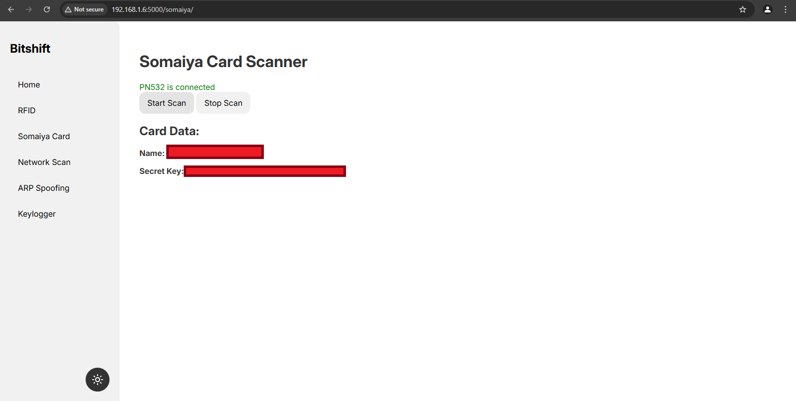

# 🚀 BitShift - Advanced Penetration Testing Toolkit

> **Final Year College Project** - A comprehensive cybersecurity toolkit built on Raspberry Pi Zero 2W with PN532 RFID Sensor

[](https://www.python.org/downloads/)
[](https://flask.palletsprojects.com/)
[](https://www.raspberrypi.org/products/raspberry-pi-zero-2-w/)
[](LICENSE)

## 📸 Final Appearance


*BitShift in action - A powerful penetration testing toolkit disguised as an innocent device*

## 🏗️ Architecture Overview


*System architecture showing the integration of hardware components and software modules*

## 🎯 What is BitShift?

BitShift is a sophisticated penetration testing toolkit designed for educational and authorized security testing purposes. Built on a Raspberry Pi Zero 2W platform with integrated PN532 RFID sensor, it provides a comprehensive suite of cybersecurity tools through an intuitive web interface.

### 🔧 Core Features

- **🔍 Network Scanning & Enumeration** - Advanced network discovery and port scanning
- **📡 RFID/NFC Operations** - Card reading, cloning, and manipulation
- **🌐 ARP Spoofing & MITM** - Network traffic interception and manipulation
- **⌨️ Keylogger Integration** - Keystroke monitoring capabilities
- **📊 Real-time System Monitoring** - CPU, memory, and disk usage tracking
- **🎭 Evil Twin Attack Setup** - Rogue access point creation
- **📶 Fake Access Point** - Deceptive WiFi network creation
- **🎣 Phishing Credential Capture** - Automated credential harvesting

## 📱 Screenshots & Features

### 🏠 Home Dashboard

*Main dashboard showing system status, RFID connection, and real-time metrics*

### 🔍 Network Scanning Interface

*Comprehensive network discovery and host enumeration capabilities*

### 🔌 Port Scanning Results

*Detailed port analysis and service identification*

### 🎭 Man-in-the-Middle Attack

*ARP spoofing interface for network traffic interception*

### 💳 RFID Card Reading

*RFID/NFC card data extraction and analysis*

### ✍️ RFID Card Writing

*RFID/NFC card cloning and data writing capabilities*

### 🎓 Somaiya Card Example

*Example of educational institution card analysis*

### ⌨️ Keylogger Interface

*Real-time keystroke monitoring and data collection*

### 📶 Fake Access Point Setup


*Deceptive WiFi network creation and management interface*

### 🎣 Phishing Credential Capture


*Automated credential harvesting from connected devices*

## 🛠️ Hardware Requirements

- **Raspberry Pi Zero 2W** - Main computing platform
- **PN532 RFID/NFC Sensor** - Card reading and writing capabilities
- **MicroSD Card** (16GB+ recommended)
- **Power Supply** (5V/2.5A recommended)
- **Network Connectivity** (WiFi/Ethernet)

## 🔌 Hardware Assembly

### Pin Diagram


*Complete wiring diagram for connecting PN532 RFID sensor to Raspberry Pi Zero 2W*

### Connection Guide
| PN532 Pin | Raspberry Pi Pin | Function |
|-----------|------------------|----------|
| VCC | 3.3V | Power Supply |
| GND | GND | Ground |
| SDA | GPIO 2 | I2C Data Line |
| SCL | GPIO 3 | I2C Clock Line |

**⚠️ Important Notes:**
- Ensure proper voltage levels (3.3V only)
- Double-check all connections before powering on
- Use appropriate jumper wires for secure connections

## 📋 Prerequisites

- Raspberry Pi OS (latest version)
- Python 3.8+
- Git
- Administrative privileges

## 🚀 Installation & Setup

### Step 1: Initial Setup
```bash
# Update system and install git
sudo apt update && sudo apt install git

# Clone the repository
git clone https://github.com/yourusername/bitshift.git
cd bitshift
```

### Step 2: Configure Hardware
```bash
# Navigate to bin directory
cd bin

# Make scripts executable
chmod -R +x ./*

# Install dependencies
sudo ./setup-dependencies.sh
```

### Step 3: Network Configuration
```bash
# Setup USB Access Point
sudo ./setup-uap.sh

# Restart system
sudo reboot
```

### Step 4: Evil Twin Setup
```bash
# Configure hostapd
sudo ./setup-hostapd.sh

# Setup evil twin attack capabilities
sudo ./setup-eviltwin.sh

# Final restart
sudo reboot
```

### Step 5: Enable I2C Interface
```bash
# Enable I2C for RFID sensor communication
sudo raspi-config
# Navigate to: Interface Options → I2C → Enable
```

## 🎮 Usage

### Starting the Application
```bash
# Navigate to project directory
cd bitshift

# Install Python dependencies
pip install -r requirements.txt

# Run the application
python app.py
```

### Accessing the Web Interface
1. Connect to the BitShift WiFi network
2. Open your browser and navigate to: `http://<raspi ip address>:<flask port>`
3. Access the intuitive web dashboard

## 📚 Documentation

### 📖 Blackbook Documentation
For detailed technical documentation, architecture diagrams, and implementation details, refer to our comprehensive [Blackbook Documentation](https://drive.google.com/file/d/16iwzU_TrwxBDoD6FdLl5s-vPupPG_ORL/view?usp=sharing).

### 🎥 Demonstration Video
Watch BitShift in action: [Demonstration Video](https://drive.google.com/file/u/1/d/1l6lZ_Coj_7QbfuaSM3PkO8RDef5NxItb/view)

## 🔧 Technical Stack

### Backend
- **Flask** - Web framework
- **Python 3.8+** - Core programming language
- **psutil** - System monitoring
- **python3-nmap** - Network scanning

### Hardware Integration
- **Adafruit CircuitPython PN532** - RFID/NFC operations
- **RPi.GPIO** - GPIO control
- **pyshark** - Network packet analysis

### Frontend
- **HTML5/CSS3** - User interface
- **JavaScript** - Dynamic interactions
- **Bootstrap** - Responsive design

## ⚠️ Legal Disclaimer

**IMPORTANT**: This tool is designed for educational purposes and authorized penetration testing only. Users are responsible for ensuring they have proper authorization before using this tool on any network or system. The developers are not responsible for any misuse of this software.

## 🤝 Contributing

We welcome contributions! Please feel free to submit pull requests or open issues for bugs and feature requests.

## 📄 License

This project is licensed under the MIT License - see the [LICENSE](LICENSE) file for details.

## 🙏 Acknowledgments

- **Raspberry Pi Foundation** for the amazing hardware platform
- **Adafruit** for the excellent CircuitPython libraries
- **Flask** team for the robust web framework
- **Open Source Community** for the various tools and libraries used

---

**⚠️ For Educational Use Only** | **🔒 Use Responsibly** | **📧 Contact for Support**
